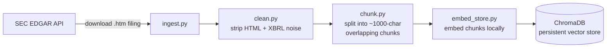
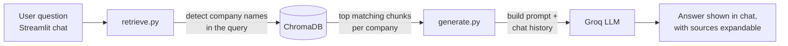

# SEC 10-K RAG Assistant

A Retrieval-Augmented Generation (RAG) system that answers natural-language questions about the annual 10-K filings of Apple, Microsoft, and Amazon — built from scratch in Python, with no orchestration framework (no LangChain/LlamaIndex), to understand every stage of the pipeline directly.

## What it does

- Fetches real, current 10-K filings directly from the SEC EDGAR API
- Cleans and parses the filings (handling Inline XBRL noise embedded in modern filings)
- Chunks the text and embeds it locally using `sentence-transformers`
- Stores embeddings in a persistent ChromaDB vector database, tagged with company metadata
- Retrieves relevant chunks per question, with multi-company detection for comparison questions (e.g. "compare Apple and Microsoft's risk factors")
- Generates grounded answers using Groq's LLM API, with conversation history support for natural follow-up questions
- Runs as an interactive Streamlit chat app

## Architecture

The system has two separate pipelines: an **offline ingestion pipeline** (run once per company to build the knowledge base) and an **online query pipeline** (run every time a user asks a question).

### 1. Ingestion pipeline (offline — run once per company)



### 2. Query pipeline (online — run per user question)



### Why two pipelines

Ingestion is expensive (downloading, cleaning, chunking, embedding) but only needs to happen **once per filing** — the result is saved permanently to ChromaDB. Querying is cheap and fast by comparison, since it just embeds one short question and searches an already-built index. This separation is standard in production RAG systems: you don't want to reprocess your entire document set every time a user asks a question.

## Tech stack

| Component | Tool |
|---|---|
| Data source | SEC EDGAR API |
| HTML parsing | BeautifulSoup |
| Embeddings | `sentence-transformers` (`all-MiniLM-L6-v2`, runs locally) |
| Vector store | ChromaDB (persistent, local) |
| LLM | Groq API (`openai/gpt-oss-20b`) |
| UI | Streamlit |

## Project structure

```
sec-rag-project/
├── data/                # downloaded raw 10-K filings
├── chroma_db/           # persistent vector store (generated)
├── src/
│   ├── ingest.py         # fetch filings from SEC EDGAR
│   ├── clean.py          # strip HTML/XBRL noise to plain text
│   ├── chunk.py           # split cleaned text into overlapping chunks
│   ├── embed_store.py     # embed chunks and store in ChromaDB
│   ├── retrieve.py        # semantic + multi-company retrieval
│   └── generate.py        # prompt construction + Groq generation
├── app.py                # Streamlit chat interface
├── requirements.txt
└── README.md
```

## Setup

1. Clone the repo and create a virtual environment:
   ```bash
   python -m venv venv
   source venv/bin/activate   # Windows: venv\Scripts\activate
   ```

2. Install dependencies:
   ```bash
   pip install -r requirements.txt
   ```

3. Create a `.env` file in the project root:
   ```
   GROQ_API_KEY=your_key_here
   ```
   Get a free key at [console.groq.com](https://console.groq.com).

4. Fetch and process the filings:
   ```bash
   python src/ingest.py
   python src/embed_store.py
   ```

5. Launch the app:
   ```bash
   streamlit run app.py
   ```

## Design notes

- **Multi-company retrieval**: naive similarity search can let one company dominate all retrieved chunks in comparison questions, since it ranks purely by relevance score with no diversity guarantee. This project detects company names in the query (with fuzzy matching for typos) and retrieves separately per company to ensure balanced representation.
- **Grounded generation**: the system prompt instructs the model to answer only from retrieved content and to acknowledge gaps naturally, rather than hallucinating or exposing internal implementation details (e.g. saying "the context doesn't contain...").
- **Source transparency**: every answer can be expanded to show the exact filing excerpts used to generate it.
- **Conversation history**: prior turns are passed into the generation prompt so the assistant can resolve follow-up questions and references to earlier answers.

## Known limitations

- Retrieval itself does not use conversation history — only generation does. Vague follow-ups (e.g. "what about the second one") rely on the LLM interpreting conversation context, not on re-targeted retrieval.
- Company detection uses simple substring and fuzzy matching, not a full NLP entity extractor.
- Currently covers one fiscal year per company; no historical/multi-year comparison yet.

## Possible extensions

- Add more companies for broader comparison
- Query rewriting for better follow-up-question retrieval
- Evaluation harness (faithfulness/relevance scoring)
- Re-ranking retrieved chunks with a cross-encoder
- Multi-year filings for trend analysis over time

## Tech notes worth mentioning in interviews

- Built without a RAG framework to demonstrate understanding of each pipeline stage (chunking strategy, embedding, vector search, prompt grounding) rather than relying on library abstractions.
- Identified and fixed a real failure mode of naive vector search: similarity ranking alone does not guarantee source diversity across multiple documents, which silently broke comparison-style questions.